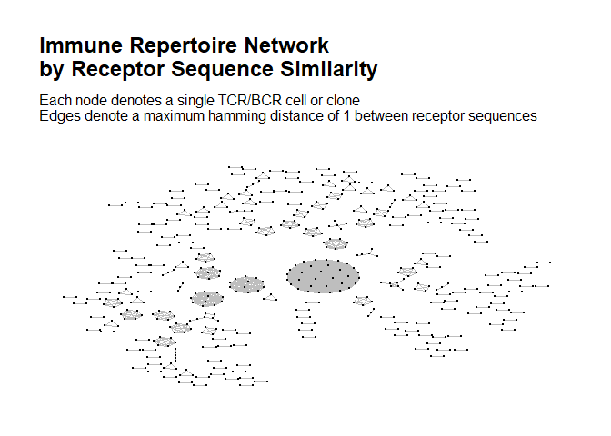
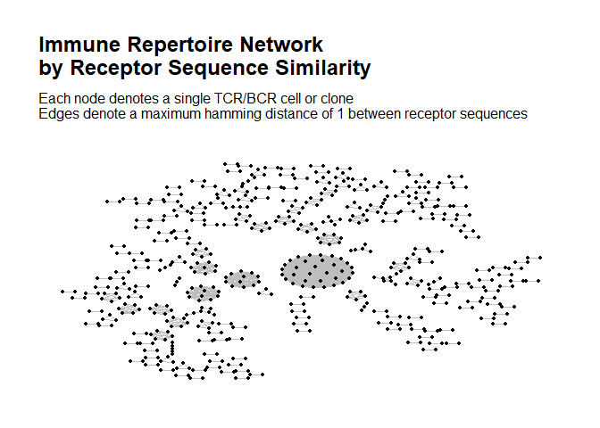
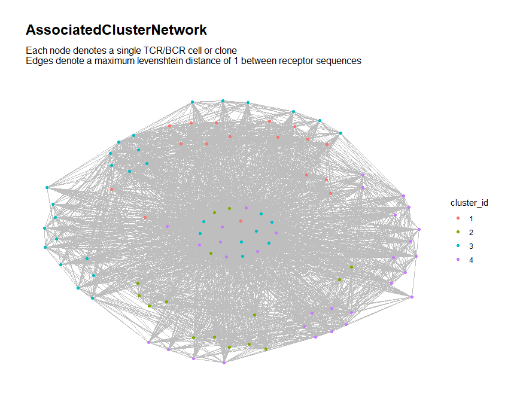
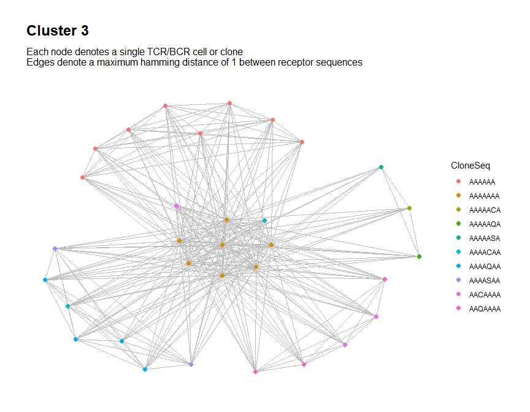
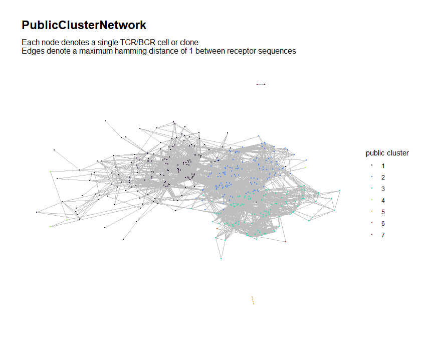
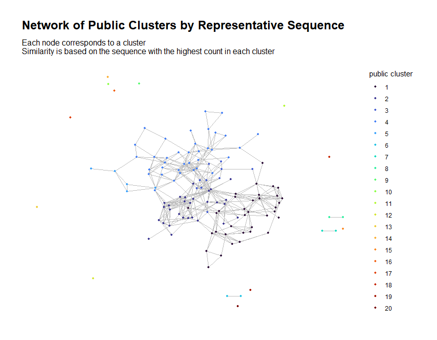

<!-- README.md is generated from README.Rmd. Please edit that file -->

# NAIR: Network Analysis of Immune Repertoire

<!-- badges: start -->
<!-- badges: end -->

The `NAIR` package facilitates network analysis of the adaptive immune
repertoire based on similarities among the receptor sequences. It
implements methods from the following paper:

Hai Yang, Jason Cham, Zenghua Fan, Brian Neal, Tao He and Li Zhang.
“NAIR: Network Analysis of Immune Repertoire” (Submitted).

### What can `NAIR` do?

`NAIR` allows the user to:

- Perform general network analysis on immune repertoire sequence
  (RepSeq) data, including computing local and global network properties
  of nodes and clusters
- Search across multiple RepSeq samples for:
- Clones/clusters associated to a clinical outcome
- Public clones/clusters
- Generate customized visualizations of the immune repertoire network
- Perform further downstream analysis

### What data does `NAIR` support?

`NAIR` supports bulk and single-cell immune repertoire sequence data for
T-cell or B-cell receptors (TCR or BCR).

- **Single-cell data:** Each row is a single T-cell/B-cell
- **Bulk data:** Each row is a distinct TCR/BCR clone (unique
  combination of V-D-J genes and nucleotide sequence) and typically
  includes a corresponding measurement of clonal abundance (e.g., clone
  count and clone frequency/fraction)

### How does `NAIR` model the immune repertoire as a network?

- Each TCR/BCR cell (single-cell data) or clone (bulk data) is modeled
  as a node (vertex) in the network
- For each node, we consider the corresponding receptor sequence
  (nucleotide or amino acid)
- For each pair of nodes, we measure the similarity in their receptor
  sequences (using the Hamming or Levenshtein distance)
- An edge is drawn between two nodes if the distance is below a
  specified threshold
- **(Added in version 0.0.9018)** For single-cell data, sequences from
  two chains (e.g., alpha chain and beta chain) can be jointly used to
  determine similarity between cells, where cells are similar if and
  only if the sequences in both chains are similar.

# Installation

The current development version of `NAIR` can be installed from github
using the following commands:

``` r
install.packages("devtools")
devtools::install_github(
  "mlizhangx/Network-Analysis-for-Repertoire-Sequencing-",
  build_vignettes = TRUE)
```

Installing the development version requires a toolchain compiler. On
Windows, this means downloading and installing Rtools. On MacOS, this
entails installing XCode Command Line Tools (“XCode CLI”) and the
correct version of gfortran for your macOS version (instructions
[here](https://thecoatlessprofessor.com/programming/cpp/r-compiler-tools-for-rcpp-on-macos/)).

# Documentation

Once the package is installed, type the following commands to access the
package vignettes and documentation:

``` r
browseVignettes("NAIR")
#> No vignettes found by browseVignettes("NAIR")
help(package = "NAIR")
```

# The `buildRepSeqNetwork()` function

General network analysis on RepSeq data is performed using the
`buildRepSeqNetwork()` function. This function does the following:

- Builds the network graph for the immune repertoire
- Computes desired network properties
- Prints a customized `ggraph` plot of the network graph
- Returns meta-data for the TCR/BCR (nodes) in the network, including
  biological as well as network properties
- If desired for downstream analysis, can also return the network
  `igraph` and adjacency matrix, as well as the `ggraph` plot object

### Load Data

For demonstration purposes, we simulate some toy data using built-in
package functions.

``` r
library(NAIR)
dir_out <- tempdir()
toy_data <- simulateToyData()
head(toy_data)
#>        CloneSeq CloneFrequency CloneCount SampleID
#> 1 TTGAGGAAATTCG    0.007873775       3095  Sample1
#> 2 GGAGATGAATCGG    0.007777102       3057  Sample1
#> 3 GTCGGGTAATTGG    0.009094910       3575  Sample1
#> 4 GCCGGGTAATTCG    0.010160859       3994  Sample1
#> 5 GAAAGAGAATTCG    0.009336593       3670  Sample1
#> 6 AGGTGGGAATTCG    0.010369470       4076  Sample1
```

## Basic Usage

- The first argument specifies the data frame containing the rep-seq
  data, where each row corresponds to a single TCR/BCR clone (bulk data)
  or cell (single-cell data).
- The second argument specifies the column name or number of the data
  frame that contains the receptor sequences to be used as the basis of
  similarity between two cells or clones.

``` r
output <- buildRepSeqNetwork(toy_data, seq_col = "CloneSeq", 
                             output_dir = dir_out)
#> Input data contains 200 rows.
#> Removing sequences with length fewer than 3 characters... Done. 200 rows remaining.
#> Computing network edges based on a max hamming distance of 1... Done.
#> Network contains 122 nodes (after removing isolated nodes).
#> Generating graph plot...
#>  Done.
#> Node-level meta-data saved to file:
#>   C:\Users\Brian\AppData\Local\Temp\RtmpIr1Z9S/MyRepSeqNetwork_NodeMetadata.csv
```



    #> Network graph plots saved to file:
    #>   C:\Users\Brian\AppData\Local\Temp\RtmpIr1Z9S/MyRepSeqNetwork.pdf
    #> Network igraph saved in edgelist format to file:
    #>   C:\Users\Brian\AppData\Local\Temp\RtmpIr1Z9S/MyRepSeqNetwork_EdgeList.txt
    #> Adjacency matrix saved to file:
    #>   C:\Users\Brian\AppData\Local\Temp\RtmpIr1Z9S/MyRepSeqNetwork_AdjacencyMatrix.mtx

The function returns a list containing the following items:

``` r
names(output)
#> [1] "igraph"           "adjacency_matrix" "node_data"        "plots"
```

The item `node_data` is a data frame containing the same columns as the
input data:

``` r
names(output$node_data)
#> [1] "CloneSeq"       "CloneFrequency" "CloneCount"     "SampleID"
```

Only rows corresponding to nodes that remain in the network graph are
included (those corresponding to the dropped isolated nodes have been
removed):

``` r
nrow(output$node_data)
#> [1] 122
```

Thus, this output data serves as biological meta-data for the nodes in
the network graph, with each row corresponding to a node seen in the
plot above.

## Network Properties

### Node-Level Network Properties

Use `node_stats = TRUE` to include node-level network properties.

``` r
# Node-level properties
output <- buildRepSeqNetwork(toy_data, "CloneSeq", node_stats = TRUE, 
                             output_dir = NULL)
```

The node data now contains node-level network properties in addition to
the biological meta-data:

``` r
names(output$node_data)
```

To choose which node-level network properties are computed, use the
`chooseNodeStats()` function, passing its output to the
`stats_to_include` argument of `buildRepSeqNetwork()`…

``` r
# example usage of chooseNodeStats()
buildRepSeqNetwork(
  toy_data, "CloneSeq", node_stats = TRUE,
  stats_to_include = chooseNodeStats(cluster_id = TRUE, closeness = FALSE))
```

…or include all network properties using either of the following
methods.

``` r
# the following two calls are equivalent:
buildRepSeqNetwork(
  toy_data, "CloneSeq", node_stats = TRUE, 
  stats_to_include = chooseNodeStats(all_stats = TRUE))

buildRepSeqNetwork(
  toy_data, "CloneSeq", node_stats = TRUE, stats_to_include = "all")
```

### Cluster-Level Network Properties

``` r
# Node-level and cluster-level properties
output <- buildRepSeqNetwork(toy_data, "CloneSeq", node_stats = TRUE, 
                             cluster_stats = TRUE, print_plots = FALSE,
                             output_dir = NULL)
#> Input data contains 200 rows.
#> Removing sequences with length fewer than 3 characters... Done. 200 rows remaining.
#> Computing network edges based on a max hamming distance of 1... Done.
#> Network contains 122 nodes (after removing isolated nodes).
#> Computing node-level network statistics... Done.
#> Computing cluster membership within the network... Done.
#> Computing statistics for the 20 clusters in the network... Done.
#> Generating graph plot with nodes colored by cluster_id... Done.
```

The output list now contains an additional data frame for the
cluster-level meta data:

``` r
names(output)
#> [1] "igraph"           "adjacency_matrix" "node_data"        "cluster_data"    
#> [5] "plots"
head(output$cluster_data)
#>   cluster_id node_count mean_seq_length mean_degree max_degree seq_w_max_degree
#> 1          1         14           13.00        3.36          9    AAAAAAAAATTGC
#> 2          2         28           12.96        8.43         18    GGGGGGGAATTGG
#> 3          3          9           12.67        2.22          4     AGAAGAAAATTC
#> 4          4          6           13.00        3.33          9    GGGGGGAAATTGG
#> 5          5          6           12.00        2.17          3     AGGGAGGAATTC
#> 6          6         25           12.00        4.60         10     AAAAAAAAATTG
#>   agg_count max_count seq_w_max_count diameter_length global_transitivity
#> 1        NA        NA              NA               5           0.5454545
#> 2        NA        NA              NA               6           0.6084437
#> 3        NA        NA              NA               7           0.2727273
#> 4        NA        NA              NA               4           0.3750000
#> 5        NA        NA              NA               5           0.4285714
#> 6        NA        NA              NA               6           0.3435115
#>   assortativity edge_density degree_centrality_index closeness_centrality_index
#> 1   -0.13886606    0.2307692               0.3076923                  0.5584465
#> 2   -0.05857037    0.2962963               0.3333333                  0.4703335
#> 3   -0.68750000    0.2500000               0.1250000                  0.2311674
#> 4   -0.50000000    0.4000000               0.2000000                  0.4266234
#> 5   -0.09090909    0.4000000               0.2000000                  0.3301948
#> 6   -0.14219251    0.1766667               0.1983333                  0.4012791
#>   eigen_centrality_index eigen_centrality_eigenvalue
#> 1              0.6572455                    3.627940
#> 2              0.5524239                   11.831606
#> 3              0.6748055                    2.238772
#> 4              0.5237142                    2.278414
#> 5              0.5707806                    2.228328
#> 6              0.6291788                    5.885769
```

Each row of the cluster-level meta data corresponds to a single cluster
in the network.

## Customized Visualization

The network graph plot produced by `buildRepSeqNetwork()` can be
customized in various ways.

``` r
buildRepSeqNetwork(toy_data, "CloneSeq",
                   dist_type = "levenshtein",
                   node_stats = TRUE,
                   color_nodes_by = "SampleID",
                   size_nodes_by = "authority_score",
                   node_size_limits = c(1, 3),
                   output_dir = NULL)
#> Input data contains 200 rows.
#> Removing sequences with length fewer than 3 characters... Done. 200 rows remaining.
#> Computing network edges based on a max levenshtein distance of 1... Done.
#> Network contains 124 nodes (after removing isolated nodes).
#> Computing node-level network statistics... Done.
#> Generating graph plot with nodes colored by SampleID...
```



    #>  Done.

## Network Settings

### Distance Function

By default, similarity between TCR/BCR sequences is based on the Hamming
distance, i.e., the number of non-matching characters in two sequences
of equal length. When sequence lengths do not match, we effectively
extend the shorter sequence, with the additional terms treated as
non-matching with those of the longer sequence.

Our package also supports the Levenshtein (edit) distance, which
measures the minimum number of single-character edits (insertions,
deletions and transformations) required to transform one sequence into
the other. It can be used in place of the Hamming distance with the
argument `dist_type = "levenshtein"`. Here we use the Levenshtein
distance to build a network based off of similarity in the CDR-3
nucleotide sequences.

``` r
# Network based on Levenshtein distance
buildRepSeqNetwork(toy_data, "CloneSeq", dist_type = "levenshtein")
```

The Levenshtein distance innately applies to sequences of differing
lengths and can correctly account for insertions and deletions, but is
more computationally expensive, which could potentially pose challenges
when working with very large data sets and using very long TCR/BCR
sequences.

### Distance Cutoff

The distance function specified in the `dist_type` argument is used to
model the similarity between TCR/BCR sequences. By default, two nodes in
the network graph share an edge if their distance, as measured by this
function, is at most 1. This cutoff value of 1 can be set to a different
value, if desired, using the `dist_cutoff` argument.

## Other Arguments

### Input Filtering

- `min_seq_length` can be used to filter out TCR/BCR sequences by
  minimum length. Data rows with sequence lengths below this value will
  be dropped before computing the network graph. The default is 3.
- `drop_matches` can be used to filter out TCR/BCR sequences by content.
  It takes a character string or regular expression and checks each
  TCR/BCR sequence for a match; data rows with matches are dropped
  before computing the network graph.

### Output

- Output is saved to the current working directory by default; a
  directory can be specified using the `output_dir` argument.
- The file type can be specified via the `output_type` argument: by
  default, each component of the returned list is saved to its own file,
  with the `output_name` argument used as a common file name prefix.
- For better compression, use a value of `"rds"` or `"rda"` for
  `output_type`, which will save the output list to a .rds or .rda file;
  the file will be named `output_name` with the appropriate file
  extension appended.
- A pdf file of the graph plot(s) will be saved if `plots = TRUE`,
  regardless of the value of `output_type`. The dimensions (in inches)
  for the pdf can be adjusted using `plot_width` and `plot_height`, with
  the defaults being `12` and `10`.

## Additional Information

For a more detailed tutorial on the `buildRepSeqNetwork` function:

``` r
vignette(topic = "buildRepSeqNetwork", package = "NAIR")
```

For more details on network visualization:

``` r
vignette(topic = "Network Visualization", package = "NAIR")
```

# Downstream Analysis

The output returned by `buildRepSeqNetwork()` and other top-level `NAIR`
functions can be used to facilitate further downstream analysis with the
help of auxiliary functions within the `NAIR` package. For more details:

``` r
vignette(topic = "Downstream Analysis", package = "NAIR")
```

# Finding Associated Clones

A set of functions has been provided to search across samples for
TCR/BCR clones associated to a sample- or subject-level binary
outcome/characteristic.

For demonstration purposes, we simulate some toy data using built-in
package functions.

``` r
# Use temp dir
data_dir <- tempdir()

# Directory to store input files
dir_input_samples <- file.path(data_dir, "input_samples")
dir.create(dir_input_samples, showWarnings = FALSE)


library(NAIR)

samples <- 30
affixes <- c("AAAA", "AASA", "AACA", "AAQA", "AAQ", "AAA", "AASAA", "AAAAA")
affix_probs_g0 <- rep(1 / length(affixes), 
                      times = length(affixes) * samples / 2)
affix_probs_g1 <- rep(c(1, 5, 1, 1, 1, 1, 5, 1), times = samples / 2)
affix_probs <- matrix(c(affix_probs_g0, affix_probs_g1),
                      nrow = samples, byrow = TRUE)
new_probs_g0 <- rep(c(1/2, 1/6, 1/6, 1/6), times = samples / 2)
new_probs_g1 <- rep(c(1/3, 1/6, 1/6, 1/3), times = samples / 2)
new_probs <- matrix(c(new_probs_g0, new_probs_g1),
                    nrow = samples, byrow = TRUE)

simulateToyData(
  samples = samples,
  sample_size = 30,
  prefix_length = 1,
  prefix_chars = c("A", "C"),
  prefix_probs = cbind(rep(1, samples), rep(0, samples)),
  affixes = affixes,
  affix_probs = affix_probs,
  num_edits = 4,
  edit_pos_probs = function(seq_length) {
    dnorm(seq(-4, 4, length.out = seq_length))
  },
  edit_ops = c("insertion", "deletion", "transmutation"),
  edit_probs = c(5, 1, 4),
  new_chars = c("A", "S", "C", "Q"),
  new_probs = new_probs,
  output_dir = dir_input_samples,
  no_return = TRUE
)
#> [1] TRUE
```

## 1. Find Associated Sequences

The first step is to search across samples for associated sequences
based on Fisher’s exact test $P$-value using the `findAssociatedSeqs`
function. The primary argument `file_list` accepts a character vector of
file paths, each containing the RepSeq data for an individual sample.

When we simulated our data, 30 samples were created as individual data
frames, with each saved to a separate file using the .rds file format.
We create the vector of file paths for these input files below:

``` r
# input files for step 1 (one per sample)
input_files <- file.path(dir_input_samples, paste0("Sample", 1:samples, ".rds"))
head(input_files)
#> [1] "C:\\Users\\Brian\\AppData\\Local\\Temp\\RtmpIr1Z9S/input_samples/Sample1.rds"
#> [2] "C:\\Users\\Brian\\AppData\\Local\\Temp\\RtmpIr1Z9S/input_samples/Sample2.rds"
#> [3] "C:\\Users\\Brian\\AppData\\Local\\Temp\\RtmpIr1Z9S/input_samples/Sample3.rds"
#> [4] "C:\\Users\\Brian\\AppData\\Local\\Temp\\RtmpIr1Z9S/input_samples/Sample4.rds"
#> [5] "C:\\Users\\Brian\\AppData\\Local\\Temp\\RtmpIr1Z9S/input_samples/Sample5.rds"
#> [6] "C:\\Users\\Brian\\AppData\\Local\\Temp\\RtmpIr1Z9S/input_samples/Sample6.rds"
```

When calling `findAssociatedSeqs()`, we specify the file format of our
input files using `input_type = "rds"`; other supported formats include
rda, csv, and files that can be read using `read.table()`, such as tsv
and txt files.

The `group_ids` argument is used to assign each sample to one of the two
binary outcome groups. The argument takes a character vector of the same
length as `file_list`, where each value is the group label/ID for the
corresponding sample. Any values may be used for the group labels, as
long as the vector contains exactly two unique values.

In our simulated data, the first half of the samples correspond to the
reference group, while the last half correspond to the comparison group:

``` r
# group labels for the samples
group_labels <- c(rep("reference", samples / 2), rep("comparison", samples / 2))
```

The `groups` argument is used to specify which of the two group ID
values denotes the reference group and which value denotes the
comparison group. The argument takes a character vector of length 2,
where the first and second elements always correspond to the reference
and comparison groups, respectively.

The `subject_ids` argument can be used to assign each sample to a
particular subject in a manner similar to the `group_ids` argument. If
not provided, each sample is treated as coming from a distinct subject
when conducting the Fisher’s exact tests.

The `sample_ids` argument can be used to assign custom sample IDs; by
default, the samples are labeled numerically according to the order they
appear in `file_list`.

``` r
# search across samples for associated sequences using Fisher's exact test
associated_seqs <- findAssociatedSeqs(
  file_list = input_files, input_type = "rds", 
  group_ids = group_labels, groups = c("reference", "comparison"), 
  min_seq_length = NULL, drop_matches = NULL,
  seq_col = "CloneSeq", outfile = NULL)
#> Data contains 30 samples, 15 of which belong to the reference group and 15 of which belong to the comparison group.
#> >>> Loading and compiling data from all samples:
#> Loading sample 1: Input data contains 30 rows.
#> Loading sample 2: Input data contains 30 rows.
#> Loading sample 3: Input data contains 30 rows.
#> Loading sample 4: Input data contains 30 rows.
#> Loading sample 5: Input data contains 30 rows.
#> Loading sample 6: Input data contains 30 rows.
#> Loading sample 7: Input data contains 30 rows.
#> Loading sample 8: Input data contains 30 rows.
#> Loading sample 9: Input data contains 30 rows.
#> Loading sample 10: Input data contains 30 rows.
#> Loading sample 11: Input data contains 30 rows.
#> Loading sample 12: Input data contains 30 rows.
#> Loading sample 13: Input data contains 30 rows.
#> Loading sample 14: Input data contains 30 rows.
#> Loading sample 15: Input data contains 30 rows.
#> Loading sample 16: Input data contains 30 rows.
#> Loading sample 17: Input data contains 30 rows.
#> Loading sample 18: Input data contains 30 rows.
#> Loading sample 19: Input data contains 30 rows.
#> Loading sample 20: Input data contains 30 rows.
#> Loading sample 21: Input data contains 30 rows.
#> Loading sample 22: Input data contains 30 rows.
#> Loading sample 23: Input data contains 30 rows.
#> Loading sample 24: Input data contains 30 rows.
#> Loading sample 25: Input data contains 30 rows.
#> Loading sample 26: Input data contains 30 rows.
#> Loading sample 27: Input data contains 30 rows.
#> Loading sample 28: Input data contains 30 rows.
#> Loading sample 29: Input data contains 30 rows.
#> Loading sample 30: Input data contains 30 rows.
#> All samples loaded.
#> Extracting list of unique sequences... Done.  504 unique sequences present.
#> Filtering by sample membership (this takes a while)... Done. 24 sequences remain.
#> Filtering by Fisher's exact test P-value... Done. 1 sequences remain.
#> All done. Sorting results by Fisher's exact test P-value and returning.
```

The filtering settings can be adjusted using the arguments seen below,
which are shown with their default values:

``` r
associated_seqs <- findAssociatedSeqs(
  file_list = input_files, input_type = "rds", 
  group_ids = group_labels, groups = c("reference", "comparison"), 
  min_seq_length = 7, drop_matches = "[*|_]",
  min_sample_membership = 5, pval_cutoff = 0.05,
  seq_col = "CloneSeq")
```

The function returns a data frame containing the filtered sequences
ranked by Fisher’s exact test $P$-value along with some meta data:

``` r
head(associated_seqs)
#>    ReceptorSeq shared_by_n_samples fisher_pvalue
#> 16      AAAAAA                  16    0.00922057
#>                                                                                                             label
#> 16 Sequence present in 16 samples (of which 12 are in the comparison group)\nFisher's exact test P-value: 0.00922
```

## 2. Find Associated Clones

The next step is to use the `findAssociatedClones()` function to search
across samples for all clones within a neighborhood of each associated
sequence identified in the previous step.

``` r
# output directory for current step
dir_nbds <- file.path(data_dir, "assoc_seq_nbds")

# Identify neighborhood around each associated sequence
findAssociatedClones(
  file_list = input_files, input_type = "rds", group_ids = group_labels,
  seq_col = "CloneSeq", dist_type = "levenshtein",
  assoc_seqs = associated_seqs$ReceptorSeq,
  min_seq_length = NULL, drop_matches = NULL,
  output_dir = dir_nbds)
#> <<< Beginning search for associated clones >>>
#> Processing sample 1 of 30 (1):
#> Input data contains 30 rows.
#> Finding clones in a neighborhood of each associated sequence... Done.
#> Processing sample 2 of 30 (2):
#> Input data contains 30 rows.
#> Finding clones in a neighborhood of each associated sequence... Done.
#> Processing sample 3 of 30 (3):
#> Input data contains 30 rows.
#> Finding clones in a neighborhood of each associated sequence... Done.
#> Processing sample 4 of 30 (4):
#> Input data contains 30 rows.
#> Finding clones in a neighborhood of each associated sequence... Done.
#> Processing sample 5 of 30 (5):
#> Input data contains 30 rows.
#> Finding clones in a neighborhood of each associated sequence... Done.
#> Processing sample 6 of 30 (6):
#> Input data contains 30 rows.
#> Finding clones in a neighborhood of each associated sequence... Done.
#> Processing sample 7 of 30 (7):
#> Input data contains 30 rows.
#> Finding clones in a neighborhood of each associated sequence... Done.
#> Processing sample 8 of 30 (8):
#> Input data contains 30 rows.
#> Finding clones in a neighborhood of each associated sequence... Done.
#> Processing sample 9 of 30 (9):
#> Input data contains 30 rows.
#> Finding clones in a neighborhood of each associated sequence... Done.
#> Processing sample 10 of 30 (10):
#> Input data contains 30 rows.
#> Finding clones in a neighborhood of each associated sequence... Done.
#> Processing sample 11 of 30 (11):
#> Input data contains 30 rows.
#> Finding clones in a neighborhood of each associated sequence... Done.
#> Processing sample 12 of 30 (12):
#> Input data contains 30 rows.
#> Finding clones in a neighborhood of each associated sequence... Done.
#> Processing sample 13 of 30 (13):
#> Input data contains 30 rows.
#> Finding clones in a neighborhood of each associated sequence... Done.
#> Processing sample 14 of 30 (14):
#> Input data contains 30 rows.
#> Finding clones in a neighborhood of each associated sequence... Done.
#> Processing sample 15 of 30 (15):
#> Input data contains 30 rows.
#> Finding clones in a neighborhood of each associated sequence... Done.
#> Processing sample 16 of 30 (16):
#> Input data contains 30 rows.
#> Finding clones in a neighborhood of each associated sequence... Done.
#> Processing sample 17 of 30 (17):
#> Input data contains 30 rows.
#> Finding clones in a neighborhood of each associated sequence... Done.
#> Processing sample 18 of 30 (18):
#> Input data contains 30 rows.
#> Finding clones in a neighborhood of each associated sequence... Done.
#> Processing sample 19 of 30 (19):
#> Input data contains 30 rows.
#> Finding clones in a neighborhood of each associated sequence... Done.
#> Processing sample 20 of 30 (20):
#> Input data contains 30 rows.
#> Finding clones in a neighborhood of each associated sequence... Done.
#> Processing sample 21 of 30 (21):
#> Input data contains 30 rows.
#> Finding clones in a neighborhood of each associated sequence... Done.
#> Processing sample 22 of 30 (22):
#> Input data contains 30 rows.
#> Finding clones in a neighborhood of each associated sequence... Done.
#> Processing sample 23 of 30 (23):
#> Input data contains 30 rows.
#> Finding clones in a neighborhood of each associated sequence... Done.
#> Processing sample 24 of 30 (24):
#> Input data contains 30 rows.
#> Finding clones in a neighborhood of each associated sequence... Done.
#> Processing sample 25 of 30 (25):
#> Input data contains 30 rows.
#> Finding clones in a neighborhood of each associated sequence... Done.
#> Processing sample 26 of 30 (26):
#> Input data contains 30 rows.
#> Finding clones in a neighborhood of each associated sequence... Done.
#> Processing sample 27 of 30 (27):
#> Input data contains 30 rows.
#> Finding clones in a neighborhood of each associated sequence... Done.
#> Processing sample 28 of 30 (28):
#> Input data contains 30 rows.
#> Finding clones in a neighborhood of each associated sequence... Done.
#> Processing sample 29 of 30 (29):
#> Input data contains 30 rows.
#> Finding clones in a neighborhood of each associated sequence... Done.
#> Processing sample 30 of 30 (30):
#> Input data contains 30 rows.
#> Finding clones in a neighborhood of each associated sequence... Done.
#> >>> Done processing samples. Compiling results:
#> Gathering data from all samples for sequence 1 (AAAAAA)... Done.
#> >>> All tasks complete. Output is contained in the following directory:
#>   C:\Users\Brian\AppData\Local\Temp\RtmpIr1Z9S/assoc_seq_nbds
```

For each associated sequence, its neighborhood consists of all clones
(from all samples) within a specified distance of the associated
sequence. The distance threshold and type of distance metric used to
determine the neighborhoods can be adjusted via the `dist_type` and
`nbd_radius` arguments (by default, each neighborhood is defined based
on a maximum Hamming distance of 1).

The associated sequences to consider are specified via the `assoc_seqs`
argument, which takes a character vector. In the above example, we have
used all of the associated sequences obtained during step 1 since here
we only have one such sequence to consider. Depending on the number of
associated sequences resulting from the filter settings used in step 1,
we may not wish to consider all of the sequences returned by
`findAssociatedSeqs()`. In this case, we can simply pass a vector
containing the desired subset of sequences to the `assoc_seqs` argument.
The associated sequences from step 1 are automatically ordered by
Fisher’s exact test $P$-value so that, e.g., the 10 associated sequences
with the lowest $P$-values can be easily referenced.

Note that this function does not return any output; instead, it writes
the data for each neighborhood to a separate file in `output_dir`,
resulting in one file per associated sequence. By default, each file is
written as a csv file (this can be changed via the `output_type`
argument).

``` r
# Intermediate files created during this step
nbd_files <- file.path(dir_nbds, list.files(dir_nbds))
nbd_files
#> [1] "C:\\Users\\Brian\\AppData\\Local\\Temp\\RtmpIr1Z9S/assoc_seq_nbds/AAAAAA.csv"
```

## 3. Build Associated Cluster Network

Next, we use the `buildAssociatedClusterNetwork` function to combine all
of the clones obtained in the previous step and perform network analysis
and clustering.

The character vector provided to the `file_list` argument should contain
paths to the files created by `findAssociatedClones()` in the previous
step.

``` r
# Combine neighborhoods and perform network analysis
all_clusters <- buildAssociatedClusterNetwork(
  file_list = nbd_files,
  seq_col = "CloneSeq", dist_type = "levenshtein", size_nodes_by = 1.5,
  output_dir = file.path(data_dir, "assoc_clusters"))
#> <<< Building network of associated clones >>>
#> Input data contains 95 rows.
#> Computing network edges based on a max levenshtein distance of 1... Done.
#> Network contains 95 nodes.
#> Computing cluster membership within the network... Done.
#> Computing node-level network statistics... Done.
#> Computing statistics for the 4 clusters in the network... Done.
#> Generating graph plot with nodes colored by cluster_id...
#>  Done.
#> Node-level meta-data saved to file:
#>   C:\Users\Brian\AppData\Local\Temp\RtmpIr1Z9S/assoc_clusters/AssociatedClusterNetwork_NodeMetadata.csv
#> Cluster-level meta-data saved to file:
#>   C:\Users\Brian\AppData\Local\Temp\RtmpIr1Z9S/assoc_clusters/AssociatedClusterNetwork_ClusterMetadata.csv
```



    #> Network graph plots saved to file:
    #>   C:\Users\Brian\AppData\Local\Temp\RtmpIr1Z9S/assoc_clusters/AssociatedClusterNetwork.pdf
    #> Network igraph saved in edgelist format to file:
    #>   C:\Users\Brian\AppData\Local\Temp\RtmpIr1Z9S/assoc_clusters/AssociatedClusterNetwork_EdgeList.txt
    #> Adjacency matrix saved to file:
    #>   C:\Users\Brian\AppData\Local\Temp\RtmpIr1Z9S/assoc_clusters/AssociatedClusterNetwork_AdjacencyMatrix.mtx

If desired, we can then perform more detailed network analysis for
particular clusters of interest.

``` r
# focus on a particular cluster
buildRepSeqNetwork(
  data = all_clusters$node_data[all_clusters$node_data$cluster_id == 3, ],
  seq_col = "CloneSeq", color_nodes_by = "CloneSeq", size_nodes_by = 2,
  output_dir = NULL, output_name = "Cluster 3")
#> Input data contains 32 rows.
#> Removing sequences with length fewer than 3 characters... Done. 32 rows remaining.
#> Computing network edges based on a max hamming distance of 1... Done.
#> Network contains 32 nodes (after removing isolated nodes).
#> Generating graph plot with nodes colored by CloneSeq...
```



    #>  Done.

## 4. (Optional) K-means on Atchley factor encoding

**NOTE: This step applies to TCR CDR3 amino acid sequences only**

As an additional step in the analysis, we can take the TCR sequences
from the full network in step 3 and use a deep learning algorithm with a
trained encoder to encode each TCR sequence as a 30-dimensional numeric
vector based on the Atchley-factor representations of its amino acids.
This allows us to perform $K$-means clustering on the TCR sequences
based on their numerically encoded values.

We can then profile each sample based on how its TCRs are distributed
among the $K$-means clusters: We compute the fraction of the sample’s
unique TCR sequences that belong to each cluster, yielding a
$K$-dimensional vector representing the profile for the sample. We can
then use heatmaps to compare these profiles across samples and to assess
the correlation in profile between samples.

``` r
atchley_results <- kmeansAtchley(
  data = all_clusters$node_data,
  amino_col = "CloneSeq", sample_col = "SampleID", group_col = "GroupID",
  k = 5, output_dir = file.path(data_dir, "assoc_clusters"), 
  return_output = TRUE)
```

The ultimate purpose of `kmeansAtchley()` is to produce the two
heatmaps, which are generated using `gplots::heatmap.2()` and saved to
pdf. The numerically-encoded TCR values and the $K$-means sample
profiles will be returned if `return_output = TRUE`.

# Finding Public Clones

A set of functions has been provided to search across samples for public
clones. For demonstration, we use the same simulated toy data from the
Finding Associated Clones section.

## 1. Find Public Clusters in Each Sample

First, we use `findPublicClusters()` to perform network analysis on each
sample individually and search for public clusters based on node count
and clone count. The primary argument `file_list` accepts a character
vector of file paths, each containing the RepSeq data for an individual
sample.

When we simulated our data, 30 samples were created as individual data
frames, with each saved to a separate file using the .rds file format.
We create the vector of file paths for these input files below:

``` r
# input files for step 1 (one per sample)
input_files <- file.path(dir_input_samples, paste0("Sample", 1:samples, ".rds"))
head(input_files)
#> [1] "C:\\Users\\Brian\\AppData\\Local\\Temp\\RtmpIr1Z9S/input_samples/Sample1.rds"
#> [2] "C:\\Users\\Brian\\AppData\\Local\\Temp\\RtmpIr1Z9S/input_samples/Sample2.rds"
#> [3] "C:\\Users\\Brian\\AppData\\Local\\Temp\\RtmpIr1Z9S/input_samples/Sample3.rds"
#> [4] "C:\\Users\\Brian\\AppData\\Local\\Temp\\RtmpIr1Z9S/input_samples/Sample4.rds"
#> [5] "C:\\Users\\Brian\\AppData\\Local\\Temp\\RtmpIr1Z9S/input_samples/Sample5.rds"
#> [6] "C:\\Users\\Brian\\AppData\\Local\\Temp\\RtmpIr1Z9S/input_samples/Sample6.rds"
```

When calling `findPublicClusters()`, we specify the file format of our
input files using `input_type = "rds"`; other supported formats include
rda, csv, and files that can be read using `read.table()`, such as tsv
and txt files.

The `sample_ids` argument can be used to assign custom sample IDs; by
default, the samples are labeled numerically according to the order they
appear in `file_list`.

Most other arguments are passed to `buildRepSeqNetwork()` when
performing network analysis on each sample.

``` r
# Search across samples for public clusters
dir_filtered_samples <- file.path(data_dir, "filtered_samples")
findPublicClusters(
  file_list = input_files, input_type = "rds",
  sample_ids = paste0("Sample", 1:samples),
  seq_col = "CloneSeq", count_col = "CloneCount",
  min_seq_length = NULL, drop_matches = NULL,
  output_dir = dir_filtered_samples)
#> <<< Beginning search for public clusters >>>
#> Processing sample 1 of 30: Sample1
#> Input data contains 30 rows.
#> Computing network edges based on a max hamming distance of 1... Done.
#> Network contains 18 nodes (after removing isolated nodes).
#> Computing cluster membership within the network... Done.
#> Computing node-level network statistics... Done.
#> Computing statistics for the 5 clusters in the network... Done.
#> >>> Filtering clusters in the current sample... Done.
#> * 5 clusters (18 nodes) remain. Saving results... Done.
#> ----------------------------------------------------------------------
#> Processing sample 2 of 30: Sample2
#> Input data contains 30 rows.
#> Computing network edges based on a max hamming distance of 1... Done.
#> Network contains 13 nodes (after removing isolated nodes).
#> Computing cluster membership within the network... Done.
#> Computing node-level network statistics... Done.
#> Computing statistics for the 4 clusters in the network... Done.
#> >>> Filtering clusters in the current sample... Done.
#> * 4 clusters (13 nodes) remain. Saving results... Done.
#> ----------------------------------------------------------------------
#> Processing sample 3 of 30: Sample3
#> Input data contains 30 rows.
#> Computing network edges based on a max hamming distance of 1... Done.
#> Network contains 15 nodes (after removing isolated nodes).
#> Computing cluster membership within the network... Done.
#> Computing node-level network statistics... Done.
#> Computing statistics for the 5 clusters in the network... Done.
#> >>> Filtering clusters in the current sample... Done.
#> * 5 clusters (15 nodes) remain. Saving results... Done.
#> ----------------------------------------------------------------------
#> Processing sample 4 of 30: Sample4
#> Input data contains 30 rows.
#> Computing network edges based on a max hamming distance of 1... Done.
#> Network contains 14 nodes (after removing isolated nodes).
#> Computing cluster membership within the network... Done.
#> Computing node-level network statistics... Done.
#> Computing statistics for the 4 clusters in the network... Done.
#> >>> Filtering clusters in the current sample... Done.
#> * 4 clusters (14 nodes) remain. Saving results... Done.
#> ----------------------------------------------------------------------
#> Processing sample 5 of 30: Sample5
#> Input data contains 30 rows.
#> Computing network edges based on a max hamming distance of 1... Done.
#> Network contains 11 nodes (after removing isolated nodes).
#> Computing cluster membership within the network... Done.
#> Computing node-level network statistics... Done.
#> Computing statistics for the 4 clusters in the network... Done.
#> >>> Filtering clusters in the current sample... Done.
#> * 4 clusters (11 nodes) remain. Saving results... Done.
#> ----------------------------------------------------------------------
#> Processing sample 6 of 30: Sample6
#> Input data contains 30 rows.
#> Computing network edges based on a max hamming distance of 1... Done.
#> Network contains 16 nodes (after removing isolated nodes).
#> Computing cluster membership within the network... Done.
#> Computing node-level network statistics... Done.
#> Computing statistics for the 5 clusters in the network... Done.
#> >>> Filtering clusters in the current sample... Done.
#> * 5 clusters (16 nodes) remain. Saving results... Done.
#> ----------------------------------------------------------------------
#> Processing sample 7 of 30: Sample7
#> Input data contains 30 rows.
#> Computing network edges based on a max hamming distance of 1... Done.
#> Network contains 13 nodes (after removing isolated nodes).
#> Computing cluster membership within the network... Done.
#> Computing node-level network statistics... Done.
#> Computing statistics for the 5 clusters in the network... Done.
#> >>> Filtering clusters in the current sample... Done.
#> * 5 clusters (13 nodes) remain. Saving results... Done.
#> ----------------------------------------------------------------------
#> Processing sample 8 of 30: Sample8
#> Input data contains 30 rows.
#> Computing network edges based on a max hamming distance of 1... Done.
#> Network contains 14 nodes (after removing isolated nodes).
#> Computing cluster membership within the network... Done.
#> Computing node-level network statistics... Done.
#> Computing statistics for the 5 clusters in the network... Done.
#> >>> Filtering clusters in the current sample... Done.
#> * 5 clusters (14 nodes) remain. Saving results... Done.
#> ----------------------------------------------------------------------
#> Processing sample 9 of 30: Sample9
#> Input data contains 30 rows.
#> Computing network edges based on a max hamming distance of 1... Done.
#> Network contains 16 nodes (after removing isolated nodes).
#> Computing cluster membership within the network... Done.
#> Computing node-level network statistics... Done.
#> Computing statistics for the 4 clusters in the network... Done.
#> >>> Filtering clusters in the current sample... Done.
#> * 4 clusters (16 nodes) remain. Saving results... Done.
#> ----------------------------------------------------------------------
#> Processing sample 10 of 30: Sample10
#> Input data contains 30 rows.
#> Computing network edges based on a max hamming distance of 1... Done.
#> Network contains 12 nodes (after removing isolated nodes).
#> Computing cluster membership within the network... Done.
#> Computing node-level network statistics... Done.
#> Computing statistics for the 5 clusters in the network... Done.
#> >>> Filtering clusters in the current sample... Done.
#> * 5 clusters (12 nodes) remain. Saving results... Done.
#> ----------------------------------------------------------------------
#> Processing sample 11 of 30: Sample11
#> Input data contains 30 rows.
#> Computing network edges based on a max hamming distance of 1... Done.
#> Network contains 5 nodes (after removing isolated nodes).
#> Computing cluster membership within the network... Done.
#> Computing node-level network statistics... Done.
#> Computing statistics for the 2 clusters in the network... Done.
#> >>> Filtering clusters in the current sample... Done.
#> * 2 clusters (5 nodes) remain. Saving results... Done.
#> ----------------------------------------------------------------------
#> Processing sample 12 of 30: Sample12
#> Input data contains 30 rows.
#> Computing network edges based on a max hamming distance of 1... Done.
#> Network contains 19 nodes (after removing isolated nodes).
#> Computing cluster membership within the network... Done.
#> Computing node-level network statistics... Done.
#> Computing statistics for the 5 clusters in the network... Done.
#> >>> Filtering clusters in the current sample... Done.
#> * 5 clusters (19 nodes) remain. Saving results... Done.
#> ----------------------------------------------------------------------
#> Processing sample 13 of 30: Sample13
#> Input data contains 30 rows.
#> Computing network edges based on a max hamming distance of 1... Done.
#> Network contains 17 nodes (after removing isolated nodes).
#> Computing cluster membership within the network... Done.
#> Computing node-level network statistics... Done.
#> Computing statistics for the 5 clusters in the network... Done.
#> >>> Filtering clusters in the current sample... Done.
#> * 5 clusters (17 nodes) remain. Saving results... Done.
#> ----------------------------------------------------------------------
#> Processing sample 14 of 30: Sample14
#> Input data contains 30 rows.
#> Computing network edges based on a max hamming distance of 1... Done.
#> Network contains 18 nodes (after removing isolated nodes).
#> Computing cluster membership within the network... Done.
#> Computing node-level network statistics... Done.
#> Computing statistics for the 3 clusters in the network... Done.
#> >>> Filtering clusters in the current sample... Done.
#> * 3 clusters (18 nodes) remain. Saving results... Done.
#> ----------------------------------------------------------------------
#> Processing sample 15 of 30: Sample15
#> Input data contains 30 rows.
#> Computing network edges based on a max hamming distance of 1... Done.
#> Network contains 19 nodes (after removing isolated nodes).
#> Computing cluster membership within the network... Done.
#> Computing node-level network statistics... Done.
#> Computing statistics for the 5 clusters in the network... Done.
#> >>> Filtering clusters in the current sample... Done.
#> * 5 clusters (19 nodes) remain. Saving results... Done.
#> ----------------------------------------------------------------------
#> Processing sample 16 of 30: Sample16
#> Input data contains 30 rows.
#> Computing network edges based on a max hamming distance of 1... Done.
#> Network contains 6 nodes (after removing isolated nodes).
#> Computing cluster membership within the network... Done.
#> Computing node-level network statistics... Done.
#> Computing statistics for the 2 clusters in the network... Done.
#> >>> Filtering clusters in the current sample... Done.
#> * 2 clusters (6 nodes) remain. Saving results... Done.
#> ----------------------------------------------------------------------
#> Processing sample 17 of 30: Sample17
#> Input data contains 30 rows.
#> Computing network edges based on a max hamming distance of 1... Done.
#> Network contains 12 nodes (after removing isolated nodes).
#> Computing cluster membership within the network... Done.
#> Computing node-level network statistics... Done.
#> Computing statistics for the 6 clusters in the network... Done.
#> >>> Filtering clusters in the current sample... Done.
#> * 6 clusters (12 nodes) remain. Saving results... Done.
#> ----------------------------------------------------------------------
#> Processing sample 18 of 30: Sample18
#> Input data contains 30 rows.
#> Computing network edges based on a max hamming distance of 1... Done.
#> Network contains 15 nodes (after removing isolated nodes).
#> Computing cluster membership within the network... Done.
#> Computing node-level network statistics... Done.
#> Computing statistics for the 5 clusters in the network... Done.
#> >>> Filtering clusters in the current sample... Done.
#> * 5 clusters (15 nodes) remain. Saving results... Done.
#> ----------------------------------------------------------------------
#> Processing sample 19 of 30: Sample19
#> Input data contains 30 rows.
#> Computing network edges based on a max hamming distance of 1... Done.
#> Network contains 16 nodes (after removing isolated nodes).
#> Computing cluster membership within the network... Done.
#> Computing node-level network statistics... Done.
#> Computing statistics for the 7 clusters in the network... Done.
#> >>> Filtering clusters in the current sample... Done.
#> * 7 clusters (16 nodes) remain. Saving results... Done.
#> ----------------------------------------------------------------------
#> Processing sample 20 of 30: Sample20
#> Input data contains 30 rows.
#> Computing network edges based on a max hamming distance of 1... Done.
#> Network contains 11 nodes (after removing isolated nodes).
#> Computing cluster membership within the network... Done.
#> Computing node-level network statistics... Done.
#> Computing statistics for the 4 clusters in the network... Done.
#> >>> Filtering clusters in the current sample... Done.
#> * 4 clusters (11 nodes) remain. Saving results... Done.
#> ----------------------------------------------------------------------
#> Processing sample 21 of 30: Sample21
#> Input data contains 30 rows.
#> Computing network edges based on a max hamming distance of 1... Done.
#> Network contains 4 nodes (after removing isolated nodes).
#> Computing cluster membership within the network... Done.
#> Computing node-level network statistics... Done.
#> Computing statistics for the 2 clusters in the network... Done.
#> >>> Filtering clusters in the current sample... Done.
#> * 2 clusters (4 nodes) remain. Saving results... Done.
#> ----------------------------------------------------------------------
#> Processing sample 22 of 30: Sample22
#> Input data contains 30 rows.
#> Computing network edges based on a max hamming distance of 1... Done.
#> Network contains 14 nodes (after removing isolated nodes).
#> Computing cluster membership within the network... Done.
#> Computing node-level network statistics... Done.
#> Computing statistics for the 4 clusters in the network... Done.
#> >>> Filtering clusters in the current sample... Done.
#> * 4 clusters (14 nodes) remain. Saving results... Done.
#> ----------------------------------------------------------------------
#> Processing sample 23 of 30: Sample23
#> Input data contains 30 rows.
#> Computing network edges based on a max hamming distance of 1... Done.
#> Network contains 15 nodes (after removing isolated nodes).
#> Computing cluster membership within the network... Done.
#> Computing node-level network statistics... Done.
#> Computing statistics for the 6 clusters in the network... Done.
#> >>> Filtering clusters in the current sample... Done.
#> * 6 clusters (15 nodes) remain. Saving results... Done.
#> ----------------------------------------------------------------------
#> Processing sample 24 of 30: Sample24
#> Input data contains 30 rows.
#> Computing network edges based on a max hamming distance of 1... Done.
#> Network contains 17 nodes (after removing isolated nodes).
#> Computing cluster membership within the network... Done.
#> Computing node-level network statistics... Done.
#> Computing statistics for the 7 clusters in the network... Done.
#> >>> Filtering clusters in the current sample... Done.
#> * 7 clusters (17 nodes) remain. Saving results... Done.
#> ----------------------------------------------------------------------
#> Processing sample 25 of 30: Sample25
#> Input data contains 30 rows.
#> Computing network edges based on a max hamming distance of 1... Done.
#> Network contains 9 nodes (after removing isolated nodes).
#> Computing cluster membership within the network... Done.
#> Computing node-level network statistics... Done.
#> Computing statistics for the 4 clusters in the network... Done.
#> >>> Filtering clusters in the current sample... Done.
#> * 4 clusters (9 nodes) remain. Saving results... Done.
#> ----------------------------------------------------------------------
#> Processing sample 26 of 30: Sample26
#> Input data contains 30 rows.
#> Computing network edges based on a max hamming distance of 1... Done.
#> Network contains 11 nodes (after removing isolated nodes).
#> Computing cluster membership within the network... Done.
#> Computing node-level network statistics... Done.
#> Computing statistics for the 5 clusters in the network... Done.
#> >>> Filtering clusters in the current sample... Done.
#> * 5 clusters (11 nodes) remain. Saving results... Done.
#> ----------------------------------------------------------------------
#> Processing sample 27 of 30: Sample27
#> Input data contains 30 rows.
#> Computing network edges based on a max hamming distance of 1... Done.
#> Network contains 13 nodes (after removing isolated nodes).
#> Computing cluster membership within the network... Done.
#> Computing node-level network statistics... Done.
#> Computing statistics for the 5 clusters in the network... Done.
#> >>> Filtering clusters in the current sample... Done.
#> * 5 clusters (13 nodes) remain. Saving results... Done.
#> ----------------------------------------------------------------------
#> Processing sample 28 of 30: Sample28
#> Input data contains 30 rows.
#> Computing network edges based on a max hamming distance of 1... Done.
#> Network contains 7 nodes (after removing isolated nodes).
#> Computing cluster membership within the network... Done.
#> Computing node-level network statistics... Done.
#> Computing statistics for the 3 clusters in the network... Done.
#> >>> Filtering clusters in the current sample... Done.
#> * 3 clusters (7 nodes) remain. Saving results... Done.
#> ----------------------------------------------------------------------
#> Processing sample 29 of 30: Sample29
#> Input data contains 30 rows.
#> Computing network edges based on a max hamming distance of 1... Done.
#> Network contains 13 nodes (after removing isolated nodes).
#> Computing cluster membership within the network... Done.
#> Computing node-level network statistics... Done.
#> Computing statistics for the 3 clusters in the network... Done.
#> >>> Filtering clusters in the current sample... Done.
#> * 3 clusters (13 nodes) remain. Saving results... Done.
#> ----------------------------------------------------------------------
#> Processing sample 30 of 30: Sample30
#> Input data contains 30 rows.
#> Computing network edges based on a max hamming distance of 1... Done.
#> Network contains 10 nodes (after removing isolated nodes).
#> Computing cluster membership within the network... Done.
#> Computing node-level network statistics... Done.
#> Computing statistics for the 4 clusters in the network... Done.
#> >>> Filtering clusters in the current sample... Done.
#> * 4 clusters (10 nodes) remain. Saving results... Done.
#> ----------------------------------------------------------------------
#> All samples complete. Filtered data is located in the following directory:
#>   C:\Users\Brian\AppData\Local\Temp\RtmpIr1Z9S/filtered_samples
```

The search criteria for the public clusters can be adjusted using the
arguments `top_n_clusters`, `min_node_count` and `min_clone_count` as
seen below, which are shown with their default values:

``` r
findPublicClusters(
  file_list = input_files, input_type = "rds",
  seq_col = "CloneSeq", count_col = "CloneCount",
  top_n_clusters = 20, min_node_count = 10, min_clone_count = 100,
  min_seq_length = NULL, drop_matches = NULL,
  output_dir = dir_filtered_samples)
```

The top `top_n_clusters` clusters by node count within each sample will
automatically be included as public clusters. The criteria are mutually
inclusive, so any cluster satisfying any one of the three conditions
will be included as a public cluster.

Note that this function does not return any output; instead, it creates
two subdirectories within `output_dir`, named `node_meta_data` and
`cluster_meta_data`, and writes each sample’s filtered node-level and
cluster-level data to a separate file in the appropriate subdirectory,
resulting in two files per sample (one for the node-level data and one
for the cluster-level data).

``` r
# Node-level meta data for each sample's public clusters
dir_filtered_samples_node <- file.path(dir_filtered_samples, "node_meta_data")
files_filtered_samples_node <- file.path(
  dir_filtered_samples_node, list.files(dir_filtered_samples_node))
head(files_filtered_samples_node)
#> [1] "C:\\Users\\Brian\\AppData\\Local\\Temp\\RtmpIr1Z9S/filtered_samples/node_meta_data/Sample1.rds" 
#> [2] "C:\\Users\\Brian\\AppData\\Local\\Temp\\RtmpIr1Z9S/filtered_samples/node_meta_data/Sample10.rds"
#> [3] "C:\\Users\\Brian\\AppData\\Local\\Temp\\RtmpIr1Z9S/filtered_samples/node_meta_data/Sample11.rds"
#> [4] "C:\\Users\\Brian\\AppData\\Local\\Temp\\RtmpIr1Z9S/filtered_samples/node_meta_data/Sample12.rds"
#> [5] "C:\\Users\\Brian\\AppData\\Local\\Temp\\RtmpIr1Z9S/filtered_samples/node_meta_data/Sample13.rds"
#> [6] "C:\\Users\\Brian\\AppData\\Local\\Temp\\RtmpIr1Z9S/filtered_samples/node_meta_data/Sample14.rds"

# Cluster-level meta data for each sample's public clusters
dir_filtered_samples_cluster <- file.path(dir_filtered_samples, "cluster_meta_data")
files_filtered_samples_cluster <- file.path(
  dir_filtered_samples_cluster, list.files(dir_filtered_samples_cluster))
head(files_filtered_samples_cluster)
#> [1] "C:\\Users\\Brian\\AppData\\Local\\Temp\\RtmpIr1Z9S/filtered_samples/cluster_meta_data/Sample1.rds" 
#> [2] "C:\\Users\\Brian\\AppData\\Local\\Temp\\RtmpIr1Z9S/filtered_samples/cluster_meta_data/Sample10.rds"
#> [3] "C:\\Users\\Brian\\AppData\\Local\\Temp\\RtmpIr1Z9S/filtered_samples/cluster_meta_data/Sample11.rds"
#> [4] "C:\\Users\\Brian\\AppData\\Local\\Temp\\RtmpIr1Z9S/filtered_samples/cluster_meta_data/Sample12.rds"
#> [5] "C:\\Users\\Brian\\AppData\\Local\\Temp\\RtmpIr1Z9S/filtered_samples/cluster_meta_data/Sample13.rds"
#> [6] "C:\\Users\\Brian\\AppData\\Local\\Temp\\RtmpIr1Z9S/filtered_samples/cluster_meta_data/Sample14.rds"
```

If one wishes to also save the unfiltered network data for each sample
(containing all results from performing network analysis on each sample,
including information on all nodes, not just those in the public
clusters), this can be done by specifying a directory to the
`output_dir_unfiltered` argument.

## 2. Build Public Cluster Network

Next, we can use the `buildPublicClusterNetwork` function to gather the
public clusters from all samples, combining the clones into a single
network and and performing network analysis.

To do this, we input the files in the `node_meta_data` subdirectory
created in step 1.

``` r
dir_out <- file.path(data_dir, "public_clusters")

# Collect clones from all public clusters and perform network analysis
buildPublicClusterNetwork(
  file_list = files_filtered_samples_node,
  seq_col = "CloneSeq", count_col = "CloneCount",
  color_nodes_by = "cluster_id", output_dir = dir_out)
#> Building network of public clusters:
#> Input data contains 393 rows.
#> Removing sequences with length fewer than 3 characters... Done. 393 rows remaining.
#> Computing network edges based on a max hamming distance of 1... Done.
#> Network contains 393 nodes.
#> Computing cluster membership within the network... Done.
#> Computing node-level network statistics... Done.
#> Computing statistics for the 7 clusters in the network... Done.
#> Generating graph plot with nodes colored by cluster_id...
#>  Done.
#> Node-level meta-data saved to file:
#>   C:\Users\Brian\AppData\Local\Temp\RtmpIr1Z9S/public_clusters/PublicClusterNetwork_NodeMetadata.csv
#> Cluster-level meta-data saved to file:
#>   C:\Users\Brian\AppData\Local\Temp\RtmpIr1Z9S/public_clusters/PublicClusterNetwork_ClusterMetadata.csv
```



    #> Network graph plots saved to file:
    #>   C:\Users\Brian\AppData\Local\Temp\RtmpIr1Z9S/public_clusters/PublicClusterNetwork.pdf
    #> Network igraph saved in edgelist format to file:
    #>   C:\Users\Brian\AppData\Local\Temp\RtmpIr1Z9S/public_clusters/PublicClusterNetwork_EdgeList.txt
    #> Adjacency matrix saved to file:
    #>   C:\Users\Brian\AppData\Local\Temp\RtmpIr1Z9S/public_clusters/PublicClusterNetwork_AdjacencyMatrix.mtx

The function arguments and their behavior largely match those of
`buildRepSeqNetwork()`.

## 3. (Optional) Public Cluster Network by Representative Sequence

After performing step 1, we may find that the number of clones across
all public clusters makes performing a full network analysis (step 2)
impractical. In this case, we can rerun step 1 with more stringent
search criteria to reduce the number of public clusters. Another
approach is to use the `buildPublicClusterNetworkByRepresentative`
function to perform network analysis using a single representative clone
sequence from each public cluster (by default, the sequence with the
highest clone count).

To do this, we input the files in the `cluster_meta_data` subdirectory
created in step 1.

``` r
buildPublicClusterNetworkByRepresentative(
  file_list = files_filtered_samples_cluster,
  color_nodes_by = "ClusterIDPublic", output_dir = dir_out,
  size_nodes_by = 1)
#> Building network of public clusters using a representative sequence from each cluster:
#> Input data contains 133 rows.
#> Computing network edges based on a max hamming distance of 1... Done.
#> Network contains 133 nodes.
#> Computing cluster membership within the network... Done.
#> Computing node-level network statistics... Done.
#> Performing clustering on the nodes in the new network resulted in 20 clusters.
#> Computing network properties of the new clusters... Done.
#> Generating graph plot with nodes colored by ClusterIDPublic...
#>  Done.
#> Output saved to file:
#>   C:\Users\Brian\AppData\Local\Temp\RtmpIr1Z9S/public_clusters/PubClustByRepresentative.rda
```



    #> Network graph plots saved to file:
    #>   C:\Users\Brian\AppData\Local\Temp\RtmpIr1Z9S/public_clusters/PubClustByRepresentative.pdf
    #> All tasks complete.
