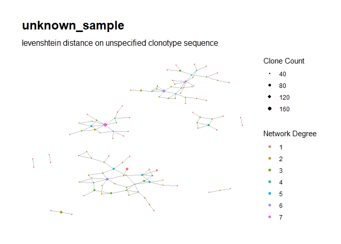
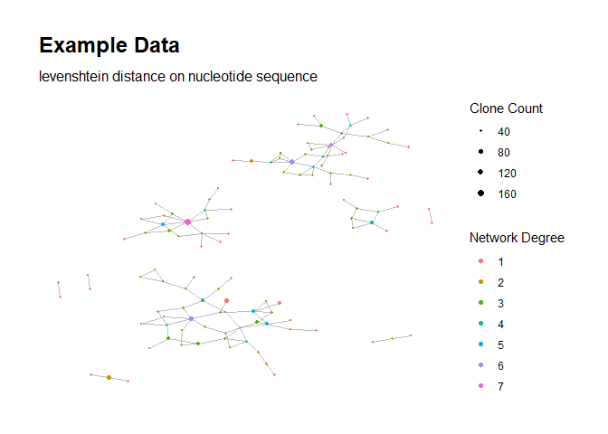
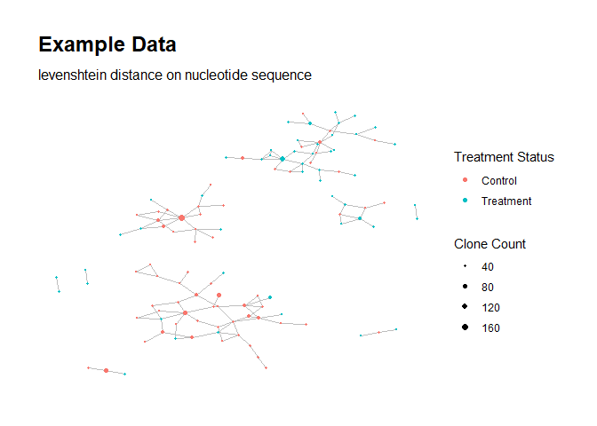

<!-- README.md is generated from README.Rmd. Please edit that file -->

# RepSeqNetworkAnalysis: Network Analysis For Repertoire-Sequencing

<!-- badges: start -->
<!-- badges: end -->

Given bulk TCR/BCR repertoire-sequence data, this package does the
following:

-   Computes aggregate counts for the unique nontrivial clonotypes
    (sequences of length at least 3)
-   Computes pairwise dissimilarities among these sequences using the
    specified dissimilarity measure (Levenshtein distance is used by
    default; Hamming distance is also supported)
-   Based on the dissimilarities, constructs an adjacency matrix for
    clonotype sequences corresponding to nodes with positive network
    degree, and generates the corresponding network graph using the
    `igraph` package
-   Computes and records node-level and cluster-level graph
    characteristics using `igraph`
-   Creates a `ggraph` object containing a visual plot of the network
    graph

## Installation

You can install the development version of `RepSeqNetworkAnalysis` using
the following commands in `R`:

    install.packages("devtools")
    devtools::install_github("mlizhangx/Network-Analysis-for-Repertoire-Sequencing-")

## Python dependency

This package requires Python version 3.6 or greater to execute the main
`buildNetwork()` function. The dependency is handled automatically
thanks to the `reticulate` package; if a Python installation is not
found when `buildNetwork()` is called, the user will be automatically
prompted to install the latest miniconda Python distribution, and a
Python environment will be automatically set up.

The Python modules `numpy`, `scipy`, `pandas` and `levenshtein` are also
required, which `reticulate` will attempt to install when setting up the
Python environment. The `buildNetwork()` function checks to confirm that
they are successfully installed and available. If they are not, our
package includes a function `installPythonModules()` that will check for
and install any missing modules via calls to `reticulate::py_install()`.

If you wish to specify the Python environment to use, you can do so by
using the `use_virtualenv()` function from the `reticulate` package
prior to calling functions from `RepSeqNetworkAnalysis`.

## Build Network From RepSeq Data Using `buildNetwork()`

We begin by creating some toy data.

``` r
library(RepSeqNetworkAnalysis)
#> Loading required package: reticulate
set.seed(42)
sample_size <- 200
group_labels <- rep("Control", times = sample_size)
assign_treatment <- sample(c(TRUE, FALSE), size = sample_size, replace = TRUE)
base_seq_length <- 7
characters <- c("G", "A", "T", "C")
char_probs <- c(2/3, 2/9, 1/18, 1/18)
characters_sample <- sample(characters, 
                            size = base_seq_length * sample_size, 
                            replace = TRUE, prob = char_probs)
characters_sample <- matrix(characters_sample, ncol = sample_size)
clonotypes <- apply(characters_sample, MARGIN = 2, 
                    FUN = function(x) paste0(x, collapse = ""))
clonotypes_append <- rep("AATC", times = sample_size)
append_latent_prob <- runif(sample_size, min = 0, max = 1)
for (i in 1:sample_size) {
  treat <- assign_treatment[[i]]
  if (treat) group_labels[[i]] <- "Treatment"
  if ((treat & append_latent_prob[[i]] > 0.9) |
      (!treat & append_latent_prob[[i]] > 0.5)) {
    clonotypes_append[[i]] <- "AATCGGGG"
  } else if ((treat & append_latent_prob[[i]] > 0.8) |
      (!treat & append_latent_prob[[i]] > 0.3)) {
    clonotypes_append[[i]] <- "AATCGGT"
  } else if ((treat & append_latent_prob[[i]] > 0.7) |
      (!treat & append_latent_prob[[i]] > 0.2)) {
    clonotypes_append[[i]] <- "AATCGCT"
  } else if ((treat & append_latent_prob[[i]] > 0.5) |
      (!treat & append_latent_prob[[i]] > 0.1)) {
    clonotypes_append[[i]] <- "AATTGCT"
  } else if ((treat & append_latent_prob[[i]] > 0.25) |
      (!treat & append_latent_prob[[i]] > 0.05)) {
    clonotypes_append[[i]] <- "AATTG"
  }
  clonotypes[[i]] <- paste0(clonotypes[[i]], clonotypes_append[[i]], 
                            collapse = "")
}
counts <- rbinom(sample_size, size = 300, prob = 0.1)
frequencies <- counts/sum(counts)
data <- data.frame("clonotypes" = clonotypes,
                   "counts" = counts,
                   "frequencies" = frequencies,
                   "group_labels" = group_labels)
head(data)
#>        clonotypes counts frequencies group_labels
#> 1  AGAGGGCAATCGCT     19 0.003206210    Treatment
#> 2  GGGGGGGAATTGCT     36 0.006074924    Treatment
#> 3  GAGGGTGAATCGCT     27 0.004556193    Treatment
#> 4     GGCGAGGAATC     24 0.004049949    Treatment
#> 5 GGGGGGCAATCGGGG     48 0.008099899      Control
#> 6 AGAGGGGAATCGGGG     34 0.005737428      Control
```

#### Basic Usage

We use the `buildNetwork()` function to construct the network for our
toy data. The `buildNetwork()` function has three required inputs, which
must all be of matching length:

-   `clonotypes`: A character vector containing the clonotype sequences
    to use in building the network
-   `counts`: A numeric vector containing the corresponding clonotype
    counts
-   `frequencies`: A numeric vector containing the corresponding
    clonotype relative frequencies

The `buildNetwork()` function contains a number of optional parameters
which can be used to modify its behavior. Here we call `buildNetwork()`
omitting the optional parameters (i.e., using their default values):

``` r
net <- buildNetwork(clonotypes = clonotypes, 
                    counts = counts, 
                    frequencies = frequencies)
#> Processing repertoire-sequence data...
#> 176 unique clonotype sequences found.
#> Removing 0 clonotype sequences containing fewer than 3 characters...
#> 176 unique clonotype sequences remaining.
#> Computing pairwise distances using 'levenshtein' distance metric...
#> Adjacency matrix created using only the 115 clonotypes corresponding to graph nodes with degree > 0.
#> Generating network from adjacency matrix...
#> Computing node-level network characteristics for the 115 clonotypes (nodes) in the network...
#> 13 clusters in network. Computing cluster-level network characteristics...
#> Creating visual plot of network graph...
```



    #> All processes complete.

As reported by the function’s console output, the data is first cleaned
to aggregate the counts

A visual graph of the resulting network is displayed. Details on the
network are contained in the output of `buildNetwork()`, which we have
stored in the object `net`.

The output is a list containing the following componnets:

-   `settings`: Parameter values used when calling the `buildNetwork()`
    function.
-   `igraph`: An `igraph` network object containing the edge list for
    the network.
-   `cell_info`: A data frame containing the node-level network
    characteristics, along with the counts and frequencies.
-   `cluster_info`: A data frame containing the cluster-level network
    characteristics.
-   `ggraph`: A `ggraph` object containing the visual plot of the
    network graph (displayed above).

#### Specifying Names for Sample and for Clone Sequence Type

When calling `buildNetwork()`, we can specify a name for our sample
using the `sample_name` argument; similarly, we can specify the type of
clonotype sequence we are using with the `clone_seq_type` argument:

``` r
net <- buildNetwork(clonotypes = clonotypes, 
                    counts = counts, 
                    frequencies = frequencies, 
                    clone_seq_type = "nucleotide",
                    sample_name = "Example Data")
#> Processing repertoire-sequence data...
#> 176 unique clonotype sequences found.
#> Removing 0 clonotype sequences containing fewer than 3 characters...
#> 176 unique clonotype sequences remaining.
#> Computing pairwise distances using 'levenshtein' distance metric...
#> Adjacency matrix created using only the 115 clonotypes corresponding to graph nodes with degree > 0.
#> Generating network from adjacency matrix...
#> Computing node-level network characteristics for the 115 clonotypes (nodes) in the network...
#> 13 clusters in network. Computing cluster-level network characteristics...
#> Creating visual plot of network graph...
```



    #> All processes complete.

These names are now reflected in the visual plot, as well as in
`net$settings`:

``` r
net$settings
#> $sample_name
#> [1] "Example Data"
#> 
#> $clone_seq_type
#> [1] "nucleotide"
#> 
#> $distance_type
#> [1] "levenshtein"
#> 
#> $group_labels
#> [1] "no group labels provided"
```

#### Including group labels

When calling `buildNetwork()`, a vector of group labels can be supplied
using the `group_labels` argument. The nodes in the resulting visual
plot of the network graph will then be colored according to their group
label value. If the clonotype sequence for a node is observed in more
than one group, the group with the highest aggregate count for that
clonotype sequence is used. We can additionally provide a name for this
group label variable via the `group_type` argument; this name will be
displayed in the legend of the plot:

``` r
net <- buildNetwork(clonotypes = clonotypes, 
                    counts = counts, 
                    frequencies = frequencies, 
                    group_labels = group_labels,
                    clone_seq_type = "nucleotide",
                    sample_name = "Example Data",
                    group_type = "Treatment Status")
#> Processing repertoire-sequence data...
#> 176 unique clonotype sequences found.
#> Removing 0 clonotype sequences containing fewer than 3 characters...
#> 176 unique clonotype sequences remaining.
#> Computing pairwise distances using 'levenshtein' distance metric...
#> Adjacency matrix created using only the 115 clonotypes corresponding to graph nodes with degree > 0.
#> Generating network from adjacency matrix...
#> Computing node-level network characteristics for the 115 clonotypes (nodes) in the network...
#> 13 clusters in network. Computing cluster-level network characteristics...
#> Creating visual plot of network graph...
```



    #> All processes complete.

When no group labels are supplied, the nodes are colored according to
their network degree, as seen in earlier examples.

#### Node-Level Network Characteristics

The object `cell_info` contains data on the following variables for each
node in the network:

``` r
names(net$cell_info)
#>  [1] "cloneSeq"         "cloneCount"       "cloneFraction"    "groupLabel"      
#>  [5] "uniqueCount"      "seq_length"       "deg"              "cluster_id"      
#>  [9] "transitivity"     "eigen_centrality" "centr_eigen"      "betweenness"     
#> [13] "centr_betw"       "authority_score"  "coreness"         "page_rank"
```

#### Cluster-Level Network Characteristics

The object `cluster_info` contains data on the following variables for
each cluster in the network:

``` r
names(net$cluster_info)
#>  [1] "cluster_id"               "node_count"              
#>  [3] "motif_top_deg_beta"       "max_deg_within_cluster"  
#>  [5] "deg_mean"                 "motif_top_count_beta"    
#>  [7] "max_count_within_cluster" "cluster_total_count"     
#>  [9] "betaCDR3_length"          "diam_length"             
#> [11] "assortativity"            "transitivity"            
#> [13] "edge_density"             "centr_degree"            
#> [15] "centr_clo"                "eigen_centrality"        
#> [17] "centr_eigen"
```
