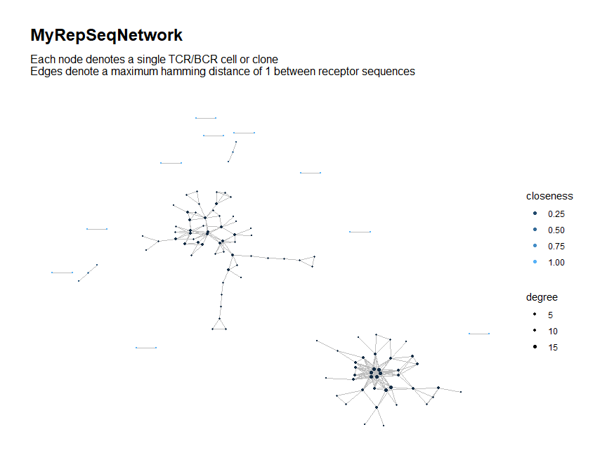

<!-- README.md is generated from README.Rmd. Please edit that file -->

# NAIR: Network Analysis of Immune Repertoire

<!-- badges: start -->
<!-- badges: end -->

The `NAIR` package facilitates network analysis of the adaptive immune
repertoire based on similarities among the receptor sequences. It
implements methods from the following paper:

Hai Yang, Jason Cham, Zenghua Fan, Brian Neal, Tao He and Li Zhang.
“NAIR: Network Analysis of Immune Repertoire” (Submitted).

### What can `NAIR` do?

`NAIR` allows the user to:

- Perform general network analysis on immune repertoire sequence
  (RepSeq) data, including computing local and global network properties
  of nodes and clusters
- Search across multiple RepSeq samples for:
  - Clones/clusters associated to a clinical outcome
  - Public clones/clusters
- Generate customized visualizations of the immune repertoire network
- Perform further downstream analysis

### What data does `NAIR` support?

`NAIR` supports bulk and single-cell immune repertoire sequence data for
T-cell or B-cell receptors (TCR or BCR).

- **Single-cell data:** Each row is a single T-cell/B-cell
- **Bulk data:** Each row is a distinct TCR/BCR clone (unique
  combination of V-D-J genes and nucleotide sequence) and typically
  includes a corresponding measurement of clonal abundance (e.g., clone
  count and clone frequency/fraction)

### How does `NAIR` model the immune repertoire as a network?

- Each TCR/BCR cell (single-cell data) or clone (bulk data) is modeled
  as a node (vertex) in the network
- For each node, we consider the corresponding receptor sequence
  (nucleotide or amino acid)
- For each pair of nodes, we measure the similarity in their receptor
  sequences (using the Hamming or Levenshtein distance)
- An edge is drawn between two nodes if the distance is below a
  specified threshold
- **(Added in version 0.0.9018)** For single-cell data, sequences from
  two chains (e.g., alpha chain and beta chain) can be jointly used to
  determine similarity between cells, where cells are similar if and
  only if the sequences in both chains are similar.

# Installation

The current development version of `NAIR` can be installed from github
using the following commands:

``` r
install.packages("devtools")
devtools::install_github(
  "mlizhangx/Network-Analysis-for-Repertoire-Sequencing-",
  build_vignettes = TRUE)
```

Installing the development version requires a toolchain compiler. On
Windows, this means downloading and installing Rtools. On MacOS, this
entails installing XCode Command Line Tools (“XCode CLI”) and the
correct version of gfortran for your macOS version (instructions
[here](https://thecoatlessprofessor.com/programming/cpp/r-compiler-tools-for-rcpp-on-macos/)).

# Documentation

Once the package is installed, type the following commands to access the
package vignettes and documentation:

``` r
browseVignettes("NAIR")
#> No vignettes found by browseVignettes("NAIR")
help(package = "NAIR")
```

# The `buildRepSeqNetwork()` function

General network analysis on RepSeq data is performed using the
`buildRepSeqNetwork()` function. This function does the following:

- Builds the network graph for the immune repertoire
- Computes desired network properties
- Prints a customized `ggraph` plot of the network graph
- Returns meta-data for the TCR/BCR (nodes) in the network, including
  biological as well as network properties
- If desired for downstream analysis, can also return the network
  `igraph` and adjacency matrix, as well as the `ggraph` plot object

### Load Data

For demonstration purposes, we simulate some toy data using built-in
package functions.

``` r
library(NAIR)
dir_out <- tempdir()
toy_data <- simulateToyData()
#> Warning in seqs[ranges[, i]] <- paste0(prefix, sample(affixes, size =
#> sample_size, : number of items to replace is not a multiple of replacement
#> length

#> Warning in seqs[ranges[, i]] <- paste0(prefix, sample(affixes, size =
#> sample_size, : number of items to replace is not a multiple of replacement
#> length
head(toy_data)
#>        CloneSeq SampleID
#> 1 TTGAGGAAATTCG        1
#> 2 GGAGATGAATCGG        1
#> 3  TTAAAAAAATTC        1
#> 4 AAAATAAAATTGG        1
#> 5                      1
#> 6                      1
```

## Basic Usage

- The first argument specifies the data frame containing the rep-seq
  data, where each row corresponds to a single TCR/BCR clone (bulk data)
  or cell (single-cell data).
- The second argument specifies the column name or number of the data
  frame that contains the receptor sequences to be used as the basis of
  similarity between two cells or clones.

``` r
output <- buildRepSeqNetwork(toy_data, seq_col = "CloneSeq", 
                             output_dir = dir_out)
#> Input data contains 200 rows.
#> Removing sequences with length fewer than 3 characters... Done. 199 rows remaining.
#> Computing network edges based on a max hamming distance of 1... Done.
#> Network contains 196 nodes (after removing isolated nodes).
#> Generating graph plot...
#>  Done.
#> Node-level meta-data saved to file:
#>   C:\Users\Brian\AppData\Local\Temp\RtmpIda8Nt/MyRepSeqNetwork_NodeMetadata.csv
```


    #> Network graph plots saved to file:
    #>   C:\Users\Brian\AppData\Local\Temp\RtmpIda8Nt/MyRepSeqNetwork.pdf
    #> Network igraph saved in edgelist format to file:
    #>   C:\Users\Brian\AppData\Local\Temp\RtmpIda8Nt/MyRepSeqNetwork_EdgeList.txt
    #> Adjacency matrix saved to file:
    #>   C:\Users\Brian\AppData\Local\Temp\RtmpIda8Nt/MyRepSeqNetwork_AdjacencyMatrix.mtx

The function returns a list containing the following items:

``` r
names(output)
#> [1] "igraph"           "adjacency_matrix" "node_data"        "plots"
```

The item `node_data` is a data frame containing the same columns as the
input data:

``` r
names(output$node_data)
#> [1] "CloneSeq" "SampleID"
```

Only rows corresponding to nodes that remain in the network graph are
included (those corresponding to the dropped isolated nodes have been
removed):

``` r
nrow(output$node_data)
#> [1] 196
```

Thus, this output data serves as biological meta-data for the nodes in
the network graph, with each row corresponding to a node seen in the
plot above.

## Network Properties

### Node-Level Network Properties

``` r
# Node-level properties
output <- buildRepSeqNetwork(toy_data, "CloneSeq", node_stats = TRUE, 
                             output_dir = NULL)
```

The node data now contains node-level network properties in addition to
the biological meta-data:

``` r
names(output$node_data)
```

To choose which node-level network properties are computed, use the
`node_stat_settings()` function, passing its output to the
`stats_to_include` argument of `buildRepSeqNetwork()`…

``` r
# example usage of node_stat_settings()
output <- buildRepSeqNetwork(
  toy_data, "CloneSeq", node_stats = TRUE,
  stats_to_include = node_stat_settings(cluster_id = TRUE, closeness = FALSE))
```

…or include all network properties using either of the following
methods.

``` r
# the following two calls are equivalent:
buildRepSeqNetwork(
  toy_data, "CloneSeq", node_stats = TRUE, 
  stats_to_include = node_stat_settings(all_stats = TRUE))

buildRepSeqNetwork(
  toy_data, "CloneSeq", node_stats = TRUE, stats_to_include = "all")
```

### Cluster-Level Network Properties

``` r
# Node-level and cluster-level properties
output <- buildRepSeqNetwork(toy_data, "CloneSeq", node_stats = TRUE, 
                             cluster_stats = TRUE, print_plots = FALSE,
                             output_dir = NULL)
#> Input data contains 200 rows.
#> Removing sequences with length fewer than 3 characters... Done. 199 rows remaining.
#> Computing network edges based on a max hamming distance of 1... Done.
#> Network contains 196 nodes (after removing isolated nodes).
#> Computing node-level network statistics... Done.
#> Computing cluster membership within the network... Done.
#> Computing statistics for the 2 clusters in the network... Done.
#> Generating graph plot with nodes colored by transitivity... Done.
```

The output list now contains an additional data frame for the
cluster-level meta data:

``` r
names(output)
#> [1] "igraph"           "adjacency_matrix" "node_data"        "cluster_data"    
#> [5] "plots"
head(output$cluster_data)
#>   cluster_id node_count mean_seq_length mean_degree max_degree seq_w_max_degree
#> 1          1        195               0         195        195                 
#> 2          2          1               0         195        195                 
#>   agg_clone_count max_clone_count seq_w_max_count diameter_length
#> 1              NA              NA              NA               2
#> 2              NA              NA              NA               1
#>   global_transitivity assortativity edge_density degree_centrality_index
#> 1                   1           NaN            1                       0
#> 2                 NaN           NaN          NaN                     NaN
#>   closeness_centrality_index eigen_centrality_index eigen_centrality_eigenvalue
#> 1                          0           1.472627e-16                         194
#> 2                        NaN           0.000000e+00                           0
```

Each row of the cluster-level meta data corresponds to a single cluster
in the network.

## Customized Visualization

The network graph plot produced by `buildRepSeqNetwork()` can be
customized in various ways.

``` r
output <- buildRepSeqNetwork(toy_data, "CloneSeq",
                             node_stats = TRUE,
                             stats_to_include = "all",
                             color_nodes_by = c("transitivity", "closeness"),
                             color_scheme = c("plasma-1", "default"),
                             size_nodes_by = "degree",
                             node_size_limits = c(0.5, 1.5),
                             output_dir = NULL)
#> Input data contains 200 rows.
#> Removing sequences with length fewer than 3 characters... Done. 199 rows remaining.
#> Computing network edges based on a max hamming distance of 1... Done.
#> Network contains 196 nodes (after removing isolated nodes).
#> Computing cluster membership within the network... Done.
#> Computing node-level network statistics... Done.
#> Generating graph plot with nodes colored by transitivity...
```


    #>  Done.
    #> Generating graph plot with nodes colored by closeness...



    #>  Done.

## Network Settings

### Distance Function

By default, similarity between TCR/BCR sequences is based on the Hamming
distance, i.e., the number of non-matching characters in two sequences
of equal length. When sequence lengths do not match, we effectively
extend the shorter sequence, with the additional terms treated as
non-matching with those of the longer sequence.

Our package also supports the Levenshtein (edit) distance, which
measures the minimum number of single-character edits (insertions,
deletions and transformations) required to transform one sequence into
the other. It can be used in place of the Hamming distance with the
argument `dist_type = "levenshtein"`. Here we use the Levenshtein
distance to build a network based off of similarity in the CDR-3
nucleotide sequences.

``` r
# Network based on Levenshtein distance
output <- buildRepSeqNetwork(toy_data, "cdr3_nt", dist_type = "levenshtein")
```

The Levenshtein distance innately applies to sequences of differing
lengths and can correctly account for insertions and deletions, but is
more computationally expensive, which could potentially pose challenges
when working with very large data sets and using very long TCR/BCR
sequences.

### Distance Cutoff

The distance function specified in the `dist_type` argument is used to
model the similarity between TCR/BCR sequences. By default, two nodes in
the network graph share an edge if their distance, as measured by this
function, is at most 1. This cutoff value of 1 can be set to a different
value, if desired, using the `dist_cutoff` argument.

## Other Arguments

### Input Filtering

- `min_seq_length` can be used to filter out TCR/BCR sequences by
  minimum length. Data rows with sequence lengths below this value will
  be dropped before computing the network graph. The default is 3.
- `drop_matches` can be used to filter out TCR/BCR sequences by content.
  It takes a character string or regular expression and checks each
  TCR/BCR sequence for a match; data rows with matches are dropped
  before computing the network graph.

### Output

- Output is saved to the current working directory by default; a
  directory can be specified using the `output_dir` argument.
- The file type can be specified via the `output_type` argument: by
  default, each component of the returned list is saved to its own file,
  with the `output_name` argument used as a common file name prefix.
- For better compression, use a value of `"rds"` or `"rda"` for
  `output_type`, which will save the output list to a .rds or .rda file;
  the file will be named `output_name` with the appropriate file
  extension appended.
- A pdf file of the graph plot(s) will be saved if `plots = TRUE`,
  regardless of the value of `output_type`. The dimensions (in inches)
  for the pdf can be adjusted using `plot_width` and `plot_height`, with
  the defaults being `12` and `10`.

## Additional Information

For a more detailed tutorial on the `buildRepSeqNetwork` function:

``` r
vignette(topic = "buildRepSeqNetwork", package = "NAIR")
#> Warning: vignette 'buildRepSeqNetwork' not found
```

For more details on network visualization:

``` r
vignette(topic = "Network Visualization", package = "NAIR")
#> Warning: vignette 'Network Visualization' not found
```

# Downstream Analysis

The output returned by `buildRepSeqNetwork()` and other top-level `NAIR`
functions can be used to facilitate further downstream analysis with the
help of auxiliary functions within the `NAIR` package. For more details:

``` r
vignette(topic = "Downstream Analysis", package = "NAIR")
#> Warning: vignette 'Downstream Analysis' not found
```

# Finding Associated Clones

A set of functions has been provided to search across samples for
TCR/BCR clones associated to a sample- or subject-level binary
outcome/characteristic. An example usage is seen below.

For a detailed tutorial:

``` r
vignette(topic = "Finding Associated Clones", package = "NAIR")
#> Warning: vignette 'Finding Associated Clones' not found
```

## 1. Find Associated Sequences

Search for associated sequences based on sample membership and Fisher’s
exact test $P$-value.

``` r
associated_seqs <- findAssociatedSeqs(
  file_list = file.path(dir_samples, list.files(dir_samples, pattern = ".tsv")),
  input_type = "table", sample_ids = sample_id_list,
  subject_ids = subject_id_list, group_ids = group_id_list,
  groups = c("reference", "comparison"),
  seq_col = "aaSeqCDR3", freq_col = "cloneFraction")
```

## 2. Find Associated Clones

Search across samples for all clones within a neighborhood of each
associated sequence identified in the previous step.

``` r
findAssociatedClones(
  file_list = file.path(dir_samples, list.files(dir_samples, pattern = ".tsv")),
  input_type = "table", sample_ids = sample_id_list,
  subject_ids = subject_id_list, group_ids = group_id_list,
  seq_col = "aaSeqCDR3",
  assoc_seqs = associated_seqs$ReceptorSeq[1:20],
  output_dir = dir_assoc_clust)
```

## 3. Build Associated Cluster Network

Combine all of the clones obtained in the previous step; perform network
analysis and clustering.

``` r
all_clusters <- buildAssociatedClusterNetwork(
  file_list = file.path(dir_assoc_clust, list.files(dir_assoc_clust)),
  seq_col = "aaSeqCDR3", output_dir = dir_out)
```

Perform more detailed network analysis for particular clusters of
interest.

``` r
# focus on a particular cluster
cluster_1 <- buildRepSeqNetwork(
  data = all_clusters$node_data[all_clusters$node_data$cluster_id == 1, ],
  seq_col = "aaSeqCDR3", output_name = "Cluster 1")
```

## 4. (Optional) K-means on Atchley factor encoding

(For TCR CDR3 amino acid sequences only) Take the clone sequences from
the network in step 3 and embed them in 30-dimensional Euclidean space
using a deep learning algorithm with a trained encoder. Perform
$K$-means clustering on the embedded values; for each sample, compute
the fraction of the sample’s total unique TCR sequences that belong to
each cluster, yielding a $K$-dimensional vector for each sample. Use
heatmaps to compare these vectors’ values and their correlation across
samples.

``` r
kmeansAtchley(
  data = all_clusters$node_data,
  amino_col = "aaSeqCDR3", sample_col = "SampleID", group_col = "GroupID",
  k = 50, output_dir = dir_out)
```

# Finding Public Clones

A set of functions has been provided to search across samples for public
clones. An example usage is seen below.

For a detailed tutorial:

``` r
vignette(topic = "Finding Public Clones", package = "NAIR")
#> Warning: vignette 'Finding Public Clones' not found
```

## 1. Find Public Clusters in Each Sample

Perform network analysis on each sample individually to search for
public clusters based on node count and clone count.

``` r
# inputs
filenames <- list.files(dir_samples, pattern = ".tsv")
file_list <- file.path(dir_samples, filenames)
sample_id_list <- as.character(strsplit(filenames, ".tsv"))

findPublicClusters(
  top_n_clusters = 20, min_node_count = 10, min_clone_count = 100,
  file_list = file_list, input_type = "table", sample_ids = sample_id_list,
  seq_col = "aaSeqCDR3", count_col = "cloneCount",
  plots = TRUE, color_scheme = "turbo",
  output_dir = dir_samples_filtered,
  output_dir_unfiltered = file.path(dir_out, "sample_networks") # optional
  )
```

## 2. Build Public Cluster Network

Take the public clusters from the previous step and combine them across
samples; perform network analysis.

``` r
filenames <- list.files(file.path(dir_samples_filtered, "node_meta_data"))
file_list <- file.path(dir_samples_filtered, "node_meta_data", filenames)

pub_clust_full <-
  buildPublicClusterNetwork(
    file_list = file_list, seq_col = "aaSeqCDR3", count_col = "cloneCount",
    color_nodes_by = c("ClusterIDPublic", "subject_id", "disease_status"),
    color_title = c("public cluster ID", "subject ID", "disease status"))
```

## 3. (Optional) Public Cluster Network by Representative Sequence

Perform network analysis using a single representative clone sequence
from each public cluster (by default, the sequence with the highest
clone count).

``` r
filenames <- list.files(file.path(dir_samples_filtered, "cluster_meta_data"))
file_list <- file.path(dir_samples_filtered, "cluster_meta_data", filenames)

buildPublicClusterNetworkByRepresentative(
  file_list = file_list, output_dir = dir_out)
```

## 4. (Optional) K-means clustering via Atchley factor encoding

(For TCR CDR3 amino acid sequences only) Take the clone sequences from
the network in step 3 and embed them in 30-dimensional Euclidean space
using a deep learning algorithm with a trained encoder. Perform
$K$-means clustering on the embedded values; for each sample, compute
the fraction of the sample’s total unique TCR sequences that belong to
each cluster, yielding a $K$-dimensional vector for each sample. Use
heatmaps to compare these vectors’ values and their correlation across
samples.

``` r
kmeansAtchley(
  pub_clust_full$node_data, amino_col = "aaSeqCDR3", sample_col = "SampleID",
  group_col = "subject_group", k = 100, output_dir = dir_out,
  file_cluster_heatmap = "atchley_kmeans_relative_clust_sizes.pdf",
  file_corr_heatmap = "atchley_kmeans_corr_in_relative_clust_sizes.pdf",
  return_output = FALSE)
```
