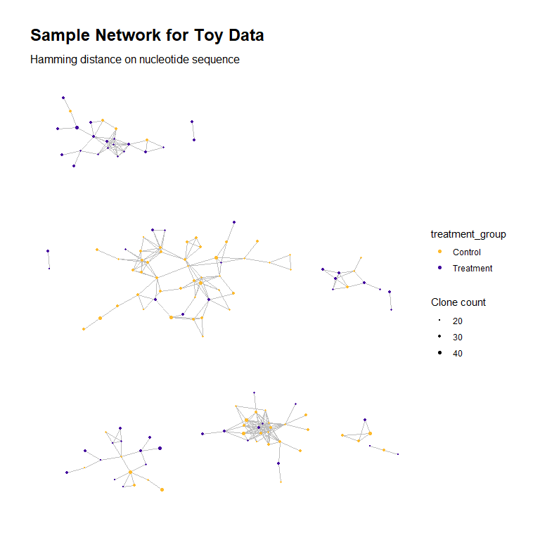

Rep-Seq Network Graph with Node and Cluster Statistics
================

In this vignette, we demonstrate the usage of the
`generateNetworkWithStats` function.

## Simulate Data

We begin by creating some toy data.

``` r
library(RepSeqNetworkAnalysis)
set.seed(42)
sample_size <- 200
group_labels <- rep("Control", times = sample_size)
assign_treatment <- sample(c(TRUE, FALSE), size = sample_size, replace = TRUE)
base_seq_length <- 7
characters <- c("G", "A", "T", "C")
char_probs <- c(2/3, 2/9, 1/18, 1/18)
characters_sample <- sample(characters, 
                            size = base_seq_length * sample_size, 
                            replace = TRUE, prob = char_probs)
characters_sample <- matrix(characters_sample, ncol = sample_size)
clonotypes <- apply(characters_sample, MARGIN = 2, 
                    FUN = function(x) paste0(x, collapse = ""))
clonotypes_append <- rep("AATC", times = sample_size)
append_latent_prob <- runif(sample_size, min = 0, max = 1)
for (i in 1:sample_size) {
  treat <- assign_treatment[[i]]
  if (treat) group_labels[[i]] <- "Treatment"
  if ((treat & append_latent_prob[[i]] > 0.9) |
      (!treat & append_latent_prob[[i]] > 0.5)) {
    clonotypes_append[[i]] <- "AATCGGGG"
  } else if ((treat & append_latent_prob[[i]] > 0.8) |
             (!treat & append_latent_prob[[i]] > 0.3)) {
    clonotypes_append[[i]] <- "AATCGGT"
  } else if ((treat & append_latent_prob[[i]] > 0.7) |
             (!treat & append_latent_prob[[i]] > 0.2)) {
    clonotypes_append[[i]] <- "AATCGCT"
  } else if ((treat & append_latent_prob[[i]] > 0.5) |
             (!treat & append_latent_prob[[i]] > 0.1)) {
    clonotypes_append[[i]] <- "AATTGCT"
  } else if ((treat & append_latent_prob[[i]] > 0.25) |
             (!treat & append_latent_prob[[i]] > 0.05)) {
    clonotypes_append[[i]] <- "AATTG"
  }
  clonotypes[[i]] <- paste0(clonotypes[[i]], clonotypes_append[[i]], 
                            collapse = "")
}
counts <- rbinom(sample_size, size = 300, prob = 0.1)
fractions <- counts/sum(counts)
data <- data.frame("clonotype" = clonotypes,
                   "count" = counts,
                   "fraction" = fractions,
                   "treatment_group" = group_labels)
head(data)
```

    ##         clonotype count    fraction treatment_group
    ## 1  AGAGGGCAATCGCT    19 0.003206210       Treatment
    ## 2  GGGGGGGAATTGCT    36 0.006074924       Treatment
    ## 3  GAGGGTGAATCGCT    27 0.004556193       Treatment
    ## 4     GGCGAGGAATC    24 0.004049949       Treatment
    ## 5 GGGGGGCAATCGGGG    48 0.008099899         Control
    ## 6 AGAGGGGAATCGGGG    34 0.005737428         Control

## Basic Usage

We use the `generateNetworkWithStats()` function to construct the
network for our toy data.

``` r
network <- 
  generateNetworkWithStats(
    data, 
    clone_col = "clonotype", count_col = "count", frac_col = "fraction",
    group_col = "treatment_group",
    output_dir = NULL)
```

    ## Creating sparse adjacency matrix for list of clonotype sequences...
    ## Adjacency matrix created for the 139 network nodes with positive degree, i.e., all sequences that are within the specified distance threshold (at most 1) of at least one other sequence.
    ## The row names of the adjacency matrix contain the original index values of the corresponding sequences; the column names contain the sequences themselves. They can be accessed using `dimnames()`
    ## Computing node-level network characteristics...
    ## 13 clusters present in network. Computing cluster characteristics...
    ## All tasks complete.

When calling the function, in addition to supplying the data frame for
our rep-seq data, we must specify the names or numbers of the columns
for the clonotype sequence, count and frequency. An optional `group_col`
argument allows us to supply an additional variable that is used to
encode the node colors in the network graph plot generated by the
function; we choose to color the nodes by treatment group (if no
argument for `group_col` is supplied, nodes will be colored by their
network degree).

## Output

All data and objects generated for the network are contained in a list
returned by `generateNetworkWithStats()`. Here we have stored the output
in the object `network`. We examine the names of its contents:

``` r
names(network)
```

    ## [1] "settings"         "node_data"        "cluster_data"     "adjacency_matrix" "network_graph"    "graph_plot"

Below is a description of each list item.

-   `settings`: Parameter values used when calling the
    `generateNetworkWithStats()` function.
-   `node_data`: A data frame containing the node-level network
    characteristics, along with the counts and frequencies.
-   `cluster_data`: A data frame containing the cluster-level network
    characteristics.
-   `adjacency_matrix`: The adjacency matrix for the network.
-   `network_graph`: An `igraph` network object containing the edge list
    for the network.
-   `graph_plot`: A `ggplot2` object, created with `ggraph`, containing
    a visual plot of the network graph.

The object `node_data` contains data on the following variables for each
node in the network. It also contains all of the variables in the
dataframe `data` originally supplied to `generateNetworkWithStats()`:

``` r
names(network$node_data)
```

    ##  [1] "clonotype"        "count"            "fraction"         "treatment_group"  "deg"              "transitivity"    
    ##  [7] "eigen_centrality" "centr_eigen"      "betweenness"      "centr_betw"       "authority_score"  "coreness"        
    ## [13] "page_rank"

Note that the names of the first few columns are determined by the
column names of our input data.

The object `cluster_data` contains data on the following variables for
each cluster in the network:

``` r
names(network$cluster_data)
```

    ##  [1] "cluster_id"        "node_count"        "mean_seq_length"   "deg_mean"          "deg_max"           "motif_w_max_deg"  
    ##  [7] "agg_clone_count"   "max_clone_count"   "motif_w_max_count" "diam_length"       "assortativity"     "transitivity"     
    ## [13] "edge_density"      "centr_degree"      "centr_clo"         "eigen_centrality"  "centr_eigen"

We view the `graph_plot` object generated by the function:

``` r
network$graph_plot
```


If desired, we can modify the plot to change aspects such its aesthetics
and labels through standard methods of working with `ggplot2` objects.
Here we replace the title and subtitle with custom text.

``` r
network$graph_plot +
  ggplot2::labs(title = "Sample Network for Toy Data",
                subtitle = "Hamming distance on nucleotide sequence")
```



## Optional Arguments

#### `dist_type`

The default distance type used to compute network adjacency is the
Hamming distance (our version accepts differing string lengths by
appending non-matching placeholder characters to the shorter string);
other options are `"levenshtein"` for the Levenshtein (edit) distance,
and `"euclidean_on_atchley"` (only applicable to amino acid sequences),
which embeds the amino acid sequences in Euclidean space based on the
Atchley factor representation of the amino acids and a trained encoding
model, then uses the Euclidean distance between the embedded values.

#### `edge_dist`

The maximum `dist_type` distance at which two clonotype sequences
(nodes) are considered adjacent in the network (share an edge). The
default value is `1`.

#### `min_seq_length`

Clonotype sequences whose length is below this value will be excluded
from the network. The default value is `3`.

#### `aggregate_counts`

If `TRUE`, rows containing identical clonotype sequences are merged and
their counts/frequencies aggregated. `FALSE` by default.

#### `group_col`

If non-null and `aggregate_counts = TRUE`, this column (name or number)
of `data` will be used to distinguish identical clonotype sequences,
which will only be merged within identical values of `group_col`.
Additionally, the network graph plot will color nodes by the value of
this variable if supplied.
